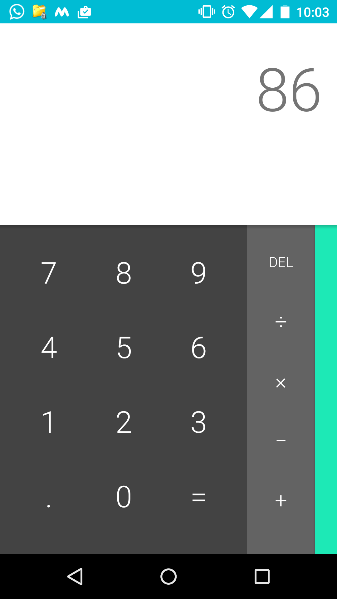

# sangeetharaju.github.io
Hi. Follow the following steps to implement the same page:
 
1. Copy the index.html content  
2. Save callum.hml in the same folder as that of index.  
3. There are no external sheets, so, no worries.  
4. You're good to go. Just pen index in your web browser.  
Lollipop calculator:  

 
My calculator:  
![alt tag] (mycalc.png)
